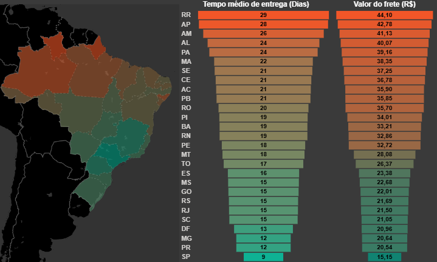
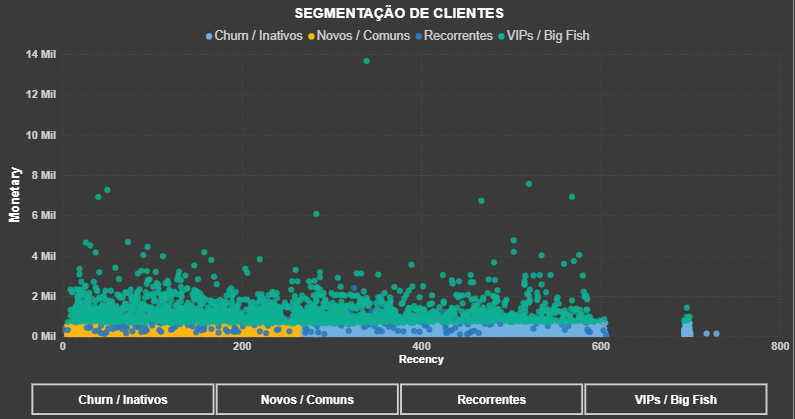
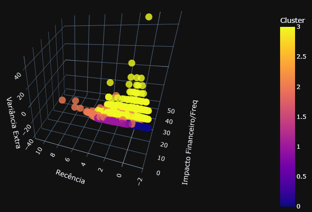
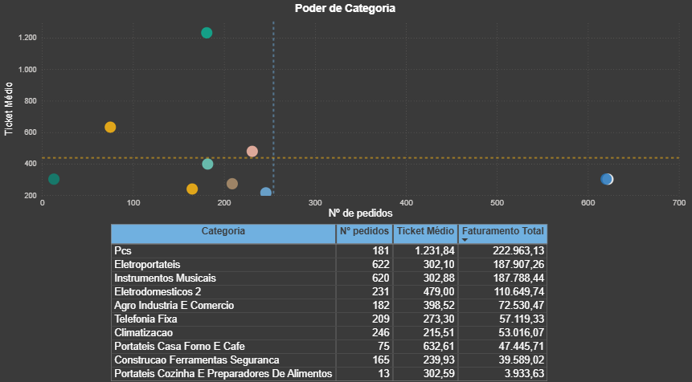
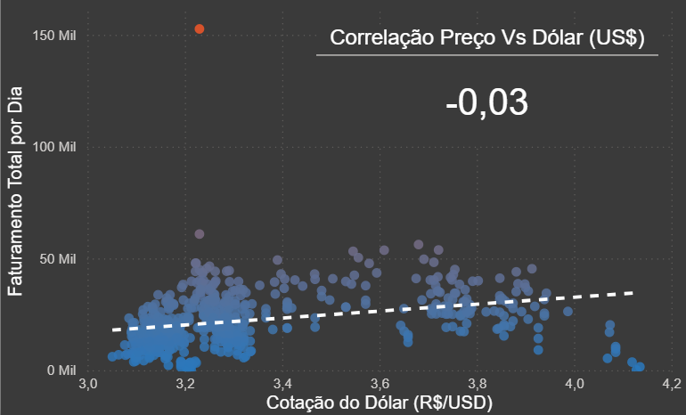
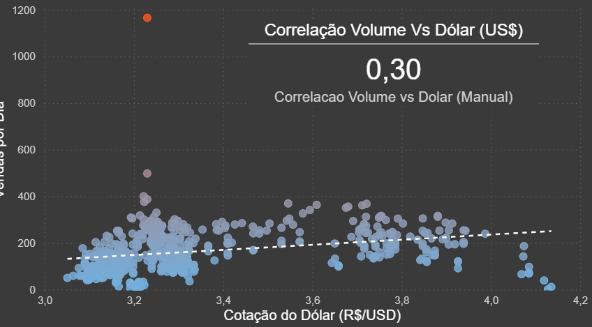
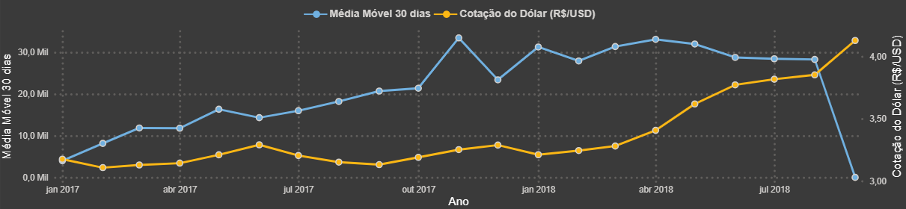

# Olist E-commerce Analytics: Inteligência Estratégica & Segmentação de Clientes

Este projeto consiste em uma solução de **Business Intelligence e Data Science** end-to-end, aplicada ao dataset público da Olist (marketplace brasileiro). O objetivo central é transcender a análise descritiva básica, utilizando **Python** para engenharia de dados e algoritmos de **Machine Learning (K-Means)** para segmentação comportamental, integrados a um dashboard interativo no **Power BI**.

A solução aborda quatro pilares estratégicos do varejo digital: eficiência logística, comportamento do consumidor (RFM), performance do mix de produtos e impactos macroeconômicos.

---

## 👨‍💻 Desenvolvido por:
 João Otávio Mochiuti

[LinkedIn](https://www.linkedin.com/in/joao-otavio-mochiuti)

---

## 🎯 Objetivo do Projeto

O objetivo principal é simular a atuação de um **Analista de Dados** dentro do ecossistema da Olist, respondendo a perguntas críticas de negócio através de dados. O projeto visa demonstrar a capacidade de manipular grandes volumes de dados, aplicar modelagem estatística e criar visualizações que suportem a tomada de decisão.

Os objetivos específicos incluem:

* **Segmentação Avançada de Clientes:** Utilizar algoritmos de *Clustering* (K-Means) para superar as limitações da análise RFM tradicional, identificando clientes "VIPs" e oportunidades de retenção.
* **Diagnóstico Operacional e Logístico:** Mapear os gargalos de entrega no território nacional, correlacionando prazos de entrega (*Lead Time*) e custos de frete para identificar desigualdades regionais.
* **Análise de Portfólio de Produtos:** Classificar categorias baseando-se na matriz de volume *versus* ticket médio.
* **Validação de Hipóteses Econômicas:** Investigar a correlação entre a variação cambial (Dólar) e o volume de vendas.

---

## 🛠️ Tecnologias e Ferramentas

Este projeto utilizou uma abordagem híbrida, combinando a robustez do Python para processamento pesado com a interatividade do Power BI.

### Linguagens e Ambientes
* **Python 3:** Linguagem principal para ETL e modelagem preditiva.
* **DAX (Data Analysis Expressions):** Criação de medidas de negócio no Power BI.
* **VSCode:** IDE para desenvolvimento dos scripts Python.
* **Power BI Desktop:** Ferramenta de Dashboard e Relatórios.
* **Google Gemini:** Assistente de IA para *Code Review* e ideação analítica.

### Bibliotecas Python
* **Pandas:** Limpeza de dados, feature engineering e *merges* complexos.
* **Scikit-Learn (sklearn):**
    * `StandardScaler`: Padronização de dados.
    * `KMeans`: Algoritmo de clusterização não-supervisionado.
* **OS:** Automação de diretórios e arquivos.
* **Plotly:** Para gerar imagem 3D interativa.

---

## ⚙️ Estrutura dos Processos

O pipeline foi desenhado para desacoplar o processamento pesado (Python) da visualização (Power BI).

### 1. Engenharia de Dados e Machine Learning (Python/VSCode)
* **Ingestão e Fusão:** Unificação dos datasets relacionais da Olist em uma visão analítica (`olist_master_data.csv`).
* **Feature Engineering (RFM):** Cálculo de Recência, Frequência e Monetário agrupados por cliente.
* **Machine Learning (Clustering):**
    * Aplicação do `StandardScaler` para normalizar escalas (Dias vs Reais).
    * Execução do algoritmo **K-Means (k=4)**.
    * Identificação automática dos perfis: *Novos Clientes/ Comuns*, *Churn/ Inativos*, *Recorrentes* e *VIPs / Bid Fish*.
* **Export:** Geração do dataset enriquecido `clientes_segmentados.csv`.

### 2. Visualização e Inteligência de Negócio (Power BI)
* **Modelagem de Dados:** Relacionamentos (Star Schema adaptado) entre Fato Vendas e Dimensão Clientes.
* **Medidas DAX Avançadas:**
    * **Logística:** Cálculo de *Lead Time* Real (`DATEDIFF`) e Taxa de Atraso.
    * **Comercial:** Participação de mercado com `ALLSELECTED`.
* **Dashboards Estratégicos:**
    * **Clientes:** Scatter Plot (Recência x Monetário) visualizando os Clusters do Python.
    * **Logística:** Mapa Coroplético (Heatmap) cruzando *Tempo de Entrega* vs *Custo de Frete* por UF.

---

## 📊 Análise Crítica e Resultados

A combinação de Engenharia de Dados com Visualização revelou:

1.  **Desigualdade Logística Regional:** evidenciou uma disparidade crítica. Enquanto estados do Sul e Sudeste (SP, PR, SC) operam com fretes baixos e entregas rápidas (< 5 dias), as regiões Norte e Nordeste enfrentam prazos de entrega até **3x maiores** e custos de frete significativamente elevados, impactando a conversão nessas regiões.

2.  **O Desafio da Recorrência (Insights do K-Means):** A segmentação via Python revelou que a grande maioria da base é composta por "compradores únicos"(*One-timers*). O cluster de VIPs, embora pequeno em volume de usuários, representa uma fatia desproporcional do faturamento, sugerindo que estratégias de CRM focadas em retenção (para o Cluster "Recorrente") e aumento de ticket (para o Cluster "Novos") são mais vitais do que apenas aquisição desenfreada.

Para validar a eficácia do algoritmo K-Means, apliquei a Análise de Componentes Principais (PCA) para reduzir a dimensionalidade dos dados RFM. A visualização 3D confirmou a alta densidade do cluster de '"compradores únicos"(*One-timers*) e a clara distinção matemática dos 'VIPs', que se posicionam em coordenadas isoladas de alto valor e frequência, validando nossa estratégia de foco em retenção.
Os valores negativos e o zero no gráfico PCA 3D não indicam recência negativa, mas sim a posição do cliente em relação à média da base. Clientes em valores negativos no eixo de recência são aqueles que compraram mais recentemente do que a média dos demais clientes, sendo, portanto, mais valiosos para a retenção.

| Cluster (Número) | Cor no Gráfico      | Persona Correspondente | Comportamento no Espaço 3D |
|-----------------|---------------------|------------------------|----------------------------|
| Cluster 3       | Amarelo Brilhante   | VIPs / Big Fish        | Estão no topo do eixo **Impacto Financeiro/Frequência**. São os pontos mais altos e isolados. |
| Cluster 2       | Laranja / Rosa      | Recorrentes            | Estão no meio do gráfico, com impacto financeiro moderado e recência baixa (mais próximos do zero no eixo de Recência). |
| Cluster 1       | Roxo                | Novos / Comuns         | Formam a base densa do gráfico. Têm baixo impacto financeiro individual, mas representam o maior volume de pontos. |
| Cluster 0       | Azul Escuro         | Churn / Inativos       | Pontos que se deslocam para a extremidade do eixo de Recência (valores mais altos), indicando muito tempo sem compra. |

3. **Foco do Portfólio:** A matriz de categorias demonstrou o Princípio de Pareto (80/20). Categorias de nicho como "PCs" e bem próximos  também "Eletroportateis" e "Instrumentos Musicais" sustentam o faturamento, enquanto uma cauda longa de categorias gera volume operacional mas pouca margem agregada.

4. **Resiliência ao Câmbio (Correlação de Preço):**
A correlação entre o faturamento total e a cotação do dólar foi de -0,03.
Isso indica que o preço praticado é independente das variações diárias da moeda americana. O negócio apresenta uma estratégia de preços sólida em moeda local, sem repasse imediato da volatilidade cambial para o consumidor final.

>A análise de dispersão permitiu identificar outliers de faturamento, o que sinaliza eventos de vendas excepcionais que neste banco de dados correspondeu a Black Friday, evento conhecido por sua abragência comercial. 

5. **Volume de Vendas vs. Dólar:**
Observou-se uma correlação positiva moderada de 0,30 entre o volume de vendas e o dólar. Embora o preço não mude, o volume de transações tende a acompanhar levemente a subida do dólar. Isso pode sugerir que, em períodos de dólar alto, o produto se torna mais atrativo ou que o período de maior demanda coincide sazonalmente com a valorização da moeda.

>A análise de dispersão permitiu identificar outliers de faturamento, o que sinaliza eventos de vendas excepcionais que neste banco de dados correspondeu a Black Friday, evento conhecido por sua abragência comercial.

6. **Dinâmica Temporal e Médias Móveis:**
O gráfico de linha mostra que a Média Móvel de 30 dias teve um crescimento consistente ao longo de 2017 e meados de 2018. A queda abrupta no final do período analisado (final de 2018) serve como um alerta para a necessidade de investigação de sazonalidade ou *interrupção na coleta de dados*, demonstrando a importância do monitoramento contínuo através do dashboard.

7.  **Granularidade:** Foi identificado que métricas de vendas exigem contagens distintas (`nunique`) devido à estrutura de itens repetidos por pedido, um erro comum que foi mitigado neste projeto.

---

## 🧠 Aprendizados Adquiridos

* **Arquitetura Híbrida:** Desacoplar ETL/ML (Python) da Visualização (Power BI) garante performance superior e evita lentidão no relatório.
* **Dados Reais:** O tratamento de dados "sujos" (strings inconsistentes, duplicatas de granularidade) consumiu 70% do tempo do projeto, refletindo a realidade do mercado.
* **Uso de IA:** A integração do Gemini no fluxo de trabalho acelerou a resolução de erros de sintaxe DAX e refinou a argumentação de negócios.

---

## ⚠️ Limitações Conhecidas

1.  **Janela Temporal:** O dataset limita-se ao período de 2016 a 2018.
2.  **Dados Financeiros:** Ausência de dados de custo de produto e marketing impede o cálculo de Margem Líquida, CAC e ROAS.

---

## 🤝 Contribuição

Este é um projeto de portfólio open-source. Sugestões e Pull Requests são bem-vindos.

1.  Faça um Fork do projeto.
2.  Crie uma Branch para sua Feature (`git checkout -b feature/-E-commerce-Analytics-Power-BI`).
3.  Faça o Commit (`git commit -m 'Add some -E-commerce-Analytics-Power-BI'`).
4.  Faça o Push (`git push origin feature/-E-commerce-Analytics-Power-BI`).
5.  Abra um Pull Request.

---
## 🤖 AI-Augmented Analysis
> **Nota de Transparência:** Este projeto foi desenvolvido com suporte técnico e analítico da Inteligência Artificial **Google Gemini**. A IA atuou como *Thought Partner* (Parceiro de Pensamento).
